# JavaWeb笔记

## 1.HTML

### 1.1HTML文件书写规范和整体框架解析 

```html
<!DOCTYPE html>     
<html lang="en">				表示整个html页面的开始，lang="zh_CN"表示中文
<head>							头信息
    <meta charset="UTF-8">		设置字符集为"UTF-8"
    <title>标题</title>			标题
</head>							
<body>							页面的主题内容
    helloworld					页面的具体内容(自己的代码)
</body>							
</html>							整个html页面的结束


html的注释:<!--  注释  -->
```

### 1.2html标签的介绍

#### 1.2.1标签的格式：

<标签名>封装的数据</标签名>  带/的为结束标签

#### 1.2.2标签名大小写不敏感

#### 1.2.3标签拥有自己的属性

##### 		1.2.3.1分为基本属性：bgcolor=“red” 可以修改简单的样式效果

##### 		1.2.3.2事件属性οnclick=“alert(‘你好！’);” 可以直接设置事件响应后的代码。

#### 1.2.4标签又分为，单标签和双标签

##### 		1.2.4.1单标签格式：<标签名 />

##### 		1.2.4.2双标签格式：<标签名>…封装数据…<标签名/>

### 1.3标签的正确语法

```html
<!DOCTYPE html>
<html lang="en">
<head>
    <meta charset="UTF-8">
    <title>0-标签语法.html</title>
</head>
<body>
	<!--标签不能交叉嵌套-->
	正确：<div><span>早安，尚硅谷</span></div>
	错误：<div><span>早安，尚硅谷</div></span>
	<hr/> hr为水平线
	<!--标签必须正确关闭(闭合)-->
	<!--1、有文本内容的标签-->
	正确：<div>早安，尚硅谷</div>
	错误：<div>早安，尚硅谷
	<hr/>
	<!--2、没有文本内容的标签-->
	正确：<br/>  br为换行
	错误：<br>
	<hr/>
	<!--属性必须有值，属性值必须加引号-->
	正确：<font color="#00bfff">早安，尚硅谷</font>
	错误：<font color=#00bfff>早安，尚硅谷</font>
	错误：<font color>早安，尚硅谷</font>
	<hr/>
    <!--注释不能嵌套-->
    正确：<!--注释内容--><br/>
    错误：<!--注释内容<!--注释内容-->-->
</body>
</html>

```

### 1.4常用标签介绍

#### 1.4.1font字体标签

```html
<!DOCTYPE html>
<html lang="en">
<head>
    <meta charset="UTF-8">
    <title>Title</title>
</head>
<body>  <!--在网页上显示我是字体标签，字体为宋体颜色为红色-->
<font color="red" face="宋体" size="7">我是字体标签</font>   color修改字体颜色，face修改字体，size修改字体大小
</body>
</html>
```

#### 1.4.2特殊字符

```html
<!DOCTYPE html>
<html lang="en">
<head>
    <meta charset="UTF-8">
    <title>Title</title>
</head>
<body>
我是&lt;br&gt;标签  如果想在页面中展示< 或者 >,要使用&lt;代表<，使用&gt;代表 >,浏览器总是会截短 HTML 页面中的空格。如果您在文本中写 10 个空格，在显					示该页面之前，浏览器会删除它们中的 9 个。如需在页面中增加空格的数量，您需要使用 &nbsp;
</body>
</html>
```

#### 1.4.3标题标签

```html
<!DOCTYPE html>
<html lang="en">
<head>
    <meta charset="UTF-8">
    <title>3-标题标签</title>
</head>
<body>
<!--标签标题
    需求1：演示标题1到标题6的
    h1-h6都是标题标签
    h1 最大
    h6 最小
    align：属性是对其属性
    left     左对齐：默认
    right    右对齐
    center   居中           
-->
<h1 align="left">标题1</h1>
<h2 align="center">标题2</h2>
<h3 align="right">标题3</h3>
<h4>标题4</h4>
<h5>标题5</h5>
<h6>标题6</h6>
</body>
</html>

```

#### 1.4.4超链接

```html
<!DOCTYPE html>
<html lang="en">
<head>
    <meta charset="UTF-8">
    <title>4-超链接</title>
</head>
<body>
<!--a标签是：超链接
        href属性设置链接的地址
        target属性设置那个目标进行跳转
            _self        表示当前页面（默认）
            _blank       表示打开新页面来进行跳转
-->
<a href="http://www.baidu.com">百度</a>
<a href="http://www.baidu.com" target="_self">百度</a>
<a href="http://www.baidu.com" target="_blank">百度</a>
</body>
</html>

```

#### 1.4.5列表标签

```html
<!DOCTYPE html>
<html lang="en">
<head>
    <meta charset="UTF-8">
    <title>Title</title>
</head>
<!--ul表示无序，ol表示有序，无序和有序的区别仅在于有序前面多了数值
type属性可以修改数据前面的符号-->
<body>
    <ol>
        <li type="none">jiejie</li>
        <li>meiko</li>
        <li>Fofo</li>
        <li>leave</li>
        <li>Ale</li>
    </ol>
</body>
</html>
```

#### 1.4.6img标签

```html
<!DOCTYPE html>
<html lang="en">
<head>
    <meta charset="UTF-8">
    <title>Family Guy</title>
</head>
    <!--
    img标签是图片标签，用来显示图片
        src属性可以设置图片的路径
        width属性可以设置图片的宽度
        height属性可以设置图片的高度
        border属性可以设置图片的边框大小
        alt属性设置当指定路径找不到图片时，用来替代显示的文本内容
     在web中路径分为相对路径和绝对路径两种
        相对路径：
            .          表示当前文件坐在的目录
            ..         表示当前文件所在的上一级目录
            文件名       表示当前文件所在目录的文件，相当于  ./文件名    ./可以省略

        绝对路径：
            正确格式是：http://ip:prot/工程名/资源路径
            错误格式是：盘符:/目录/文件名
--> 
<body>
    
</body>
</html>
```

####  1.4.7表格标签

```html
<!DOCTYPE html>
<html lang="en">
<head>
    <meta charset="UTF-8">
    <title>Family Guy</title>
</head>
        <!--table为表格标签  align可以调整表格位置居中居左居右
            tr为行标签
            td为列标签
            th为表头标签，即加粗又居中
            b为加粗标签
            cellspacing为单元格间距
            -->
<body>
    <table align="center" border="1" width="400" height="400" cellspacing="10">
        <tr>
            <th>1.1</th>
            <th>1.2</th>
            <th>1.3</th>
        </tr>
        <tr>
            <td>2.1</td>
            <td>2.2</td>
            <td>2.3</td>
        </tr>
        <tr>
            <td>3.1</td>
            <td>3.2</td>
            <td>3.3</td>
        </tr>
    </table>
</body>
</html>
```

#### 1.4.8跨行跨列表格

```html
<!DOCTYPE html>
<html lang="en">
<head>
    <meta charset="UTF-8">
    <title>Title</title>
</head>
<!--
 colspan属性设置跨列 col为列
 rowspan属性设置跨行 row为行
 跨列或者跨行之后要把所跨的列和行删掉
需求：第一行一列跨2列
      第2行1列跨2行
      第4行4列跨2行2列

 -->
<body>
    <table border="1" width="500" height="500" cellspacing="0">
        <tr>
            <th colspan="2">1.1</th>
            <th>1.3</th>
            <th>1.4</th>
            <th>1.5</th>
        </tr>
        <tr>
            <td rowspan="2">2.1</td>
            <td>2.2</td>
            <td>2.3</td>
            <td>2.4</td>
            <td>2.5</td>
        </tr>
        <tr>
            <td>3.2</td>
            <td>3.3</td>
            <td>3.4</td>
            <td>3.5</td>
        </tr>
        <tr>
            <td>4.1</td>
            <td>4.2</td>
            <td>4.3</td>
            <td rowspan="2" colspan="2">4.4</td>
        </tr>
        <tr>
            <td>5.1</td>
            <td>5.2</td>
            <td>5.3</td>
        </tr>
    </table>
</body>
</html>
```

#### 1.4.9iframe框架标签

```html
<!DOCTYPE html>
<html lang="en">
<head>
    <meta charset="UTF-8">
    <title>Title</title>
</head>
<!--
iframe标签可以在页面上面开辟一个小区域显示一个单独的页面
iframe和a标签使用步骤:
        1.在iframe标签中用name属性定义一个名称
        2.令a标签中的target属性等于iframe标签中name属性的值

 -->
<body>
    <iframe src="imag标签.html" width="500" height="500" name="if"></iframe>
    <ol>
        <li><a href="font标签.html" target="if">font标签.html</a></li>
        <li><a href="helloworld.html" target="if">helloworld.html</a></li>
    </ol>

</body>
</html>
```

#### 1.4.10表单标签

```html
<!DOCTYPE html>
<html lang="en">
<head>
    <meta charset="UTF-8">
    <title>Title</title>
</head>
<!--form表示表单标签,input是最重要的表单元素
    <input> 元素有很多形态，根据不同的 type 属性。
    <input type="text"> 定义用于文本输入的单行输入字段.
    <input type="radio"> 定义单选按钮。
    <input type="submit"> 定义用于向表单处理程序（form-handler）提交表单的按钮。
    <input type="reset"> 定义用于向表单处理程序（form-handler）重置表单的按钮。
    <select> 元素定义下拉列表：
      <option> 元素定义待选择的选项
    <textarea> 元素定义多行输入字段（文本域）
    <button> 元素定义可点击的按钮
    value 属性规定输入字段的初始值
    表单格式化可以创建一个表格来完成，使表单更加工整


    action 属性定义在提交表单时执行的动作
    method 属性规定在提交表单时所用的 HTTP 方法（GET 或 POST）

    您能够使用 GET（默认方法）：
    如果表单提交是被动的（比如搜索引擎查询），并且没有敏感信息。
    当您使用 GET 时，表单数据在页面地址栏中是可见的
    使用get方法就要给每个属性设置name值，name

    您应该使用 POST：
    如果表单正在更新数据，或者包含敏感信息（例如密码）。
    POST 的安全性更好，因为在页面地址栏中被提交的数据是不可见的。

    表单的target属性默认为_blank，即另起一个页面，这里将其修改为_self
-->
<body>
  <form action="www.baidu.com" method="get" target="_self">
    <h1 align="center">用户注册</h1>
    <table align="center">
      <tr>
        <td>用户名称:</td>
        <td><input type="text" value="default" name="username"/></td>
      </tr>
      <tr>
        <td>用户密码:</td>
        <td><input type="password" value="abc"/></td>
      </tr>
      <tr>
        <td>确认密码:</td>
        <td><input type="password" value="abc"/></td>
      </tr>
      <tr>
        <td>性别:</td>
        <td>
          <input type="radio" name="sex" checked="checked" value="man"/>男
          <input type="radio" name="sex" value="woman"/>女
        </td>
      </tr>
      <tr>
        <td>兴趣爱好:</td>
        <td>
          <input type="checkbox" checked="checked"/>Java
          <input type="checkbox" name="hobby" value="c语言"/> c语言
          <input type="checkbox"/> c++
        </td>
      </tr>
      <tr>
        <td>国籍:</td>
        <td>
          <select>
            <option>---请选择你的国籍---</option>
            <option selected="selected">China</option>
            <option>America</option>
            <option>Britain</option>
            <option>Japan</option>
          </select><br/>
        </td>
      </tr>
      <tr>
        <td>自我评价:</td>
        <td><textarea rows="20" cols="20">默认值</textarea><br/></td>
      </tr>
      <tr>
        <td><input type="reset" value="重置"/></td>
        <td><input type="button" value="点击保存"/></td>
        <td><input type="submit" value="提交"/></td>
        <td><button>点击保存</button></td>
      </tr>
    </table>
  </form>
</body>
</html>
```

#### 1.4.11其它标签(div,span,p)

```html
<!DOCTYPE html>
<html lang="en">
<head>
    <meta charset="UTF-8">
    <title>Title</title>
</head>
<!--p标签：
    注释：浏览器会自动地在段落的前后添加空行。（<p> 是块级元素）
    提示：使用空的段落标记 <p></p> 去插入一个空行是个坏习惯。用 <br /> 标签代替它！
    
    div标签默认独占一行
    span标签的长度为封装数据的长度


 -->
<body>
    <div>我是div标签</div>
    <div>我是div标签</div>
    <span>我是span标签</span>
    <span>我是span标签</span>
    <p>我是段落标签</p>
    <p>我是段落标签</p>

</body>
</html>
```

## 2.CSS技术

### 2.1CSS技术介绍

CSS是层叠样式表单。是用于控制网页样式并允许将样式信息与网页内容分离的一种标志性语言

### 2.2CSS的语法规则

选择器：浏览器根据"选择器"决定CSS样式影响的HTML元素（标签）

属性：是你要改变的样式名，并且每个属性都有一个值。属性和值被冒号分开，并由花括号包围，这样就组成了一个完整的声明，例如：p{color:bule}

多个声明：如果要定义不止一个声明，则需要用分号将声明分开。虽然最后一条声明的最后可以不用加分号（但尽量在每条声明的末尾都加上分号）

例如：

p{

color:red;

font-size:30px;

}

一般每行只描述一个属性

CSS：注释：/**/

### 2.3CSS和HTML的结合方式

#### 2.3.1第一种方式：

在标签的style属性上设置"key:value value;"，修改标签样式(缺点明显)

```html
<!DOCTYPE html>
<html lang="en">
<head>
    <meta charset="UTF-8">
    <title>Title</title>
</head>
<!--
   分别定义两个div和span标签，分别修改每个div标签的样式为：边框1个像素，实线，红色
 -->
<body>
    <div style="border: solid 1px red">我是div标签</div>
    <div style="border: solid 1px red">我是div标签</div>
    <span>我是span标签</span>
    <span>我是span标签</span>
</body>
</html>
```

#### 2.3.2第二种方式：

在head标签中，使用style标签来定义各种自己需要的css样式

格式如下：xxx为要定义的标签

xxx{

 key : value value;

}

```html
<!DOCTYPE html>
<html lang="en">
<head>
    <meta charset="UTF-8">
    <title>Title</title>
    <style>   style里面的注释要用CSS注释来写--/*  */
        div{
            border: 1px red solid;
        }
        span{
            border: 2px green dashed;
        }
        p{
            border: 10px blue groove;
        }
    </style>
</head>
<!--
   分别定义两个div和span标签，分别修改每个div标签的样式为：边框1个像素，实线，红色
 -->
<body>
    <div>我是div标签</div>
    <span>我是span标签</span>
    <p>我是段落标签</p>
</body>
</html>
```

缺点：1.只能在一个页面复用代码，不能在多个页面复用

​				2.维护起来不方便

#### 2.3.3第三种方式

把CSS样式写成一个单独的CSS文件，再通过link标签引入

CSS文件

```css
div{
    border: aliceblue solid 5px;
}

span{
    border: black solid 5px;
}

p{
    border: aliceblue solid 5px;
}
```

html文件

```html
<!DOCTYPE html>
<html lang="en">
<head>
    <meta charset="UTF-8">
    <title>Title</title>
    <link rel="stylesheet" type="text/css" href="divstyle.css"/> 使用link标签引入
</head>
<!--
   分别定义两个div和span标签，分别修改每个div标签的样式为：边框1个像素，实线，红色
 -->
<body>
    <div>我是div标签</div>
    <span>我是span标签</span>
    <p>我是段落标签</p>
</body>
</html>
```

### 2.4CSS选择器

#### 2.4.1标签名选择器

标签名选择器和上述一样

标签名{

​	属性：值

}

同上，不再插入代码块

#### 2.4.2id选择器

id选择器的格式是:

#id 属性值{

​		属性：值

}

id选择器可以让我们通过id属性选择性的使用这个样式，比如我在一个项目中要写很多个div样式或者span样式，我不用创建很多个css文件来逐个存储这些样式，可以只写一个文件通过id选择器来选择不同的样式

css文件

```css
#id001{
    color: blue;
    font-size: 30px;
    border: 1px yellow solid ;
}

#id002{
    color:red;
    font-size: 20px;
    border: 5px blue dotted;
}
```

html文件

```html
<!DOCTYPE html>
<html lang="en">
<head>
    <meta charset="UTF-8">
    <title>Title</title>
    <link rel="stylesheet" type="text/css" href="divstyle.css"/>
</head>

<body>
    <div id="id001">我是调用id001的标签</div>
    <div id="id002">我是调用id002的标签</div>
    <span id="id001">我是调用id002的span标签</span>

</body>
</html>
```

#### 2.4.3class选择器(类选择器)

格式：

.class{

属性：值

}

class类选择器，可以通过class属性有效的选择性的去使用样式，学完class选择器之后我第一时间其实不知道和id选择器的区别，因为在上个html文件中我id选择器使用了两次而且能够正常运行(虽然idea会报错但是能够跑起来)，然后就去网上搜了一下

class与id选择器的区别为：id选择器在一个html文档中只能使用一次，而class选择器可以使用多次，但是在上面的代码中id使用多次一样能正常运行(虽然idea会有红线)，在idea中一个html文档使用多次class选择器则不会报错

css文档

```css
.class01{
    color:blue;
    font-size: 30px;
    border:yellow 1px solid;

}

.class02{
    color:grey;
    font-size: 26px;
    border: 1px red solid;
    
}
```

html文档

```html
<!DOCTYPE html>
<html lang="en">
<head>
    <meta charset="UTF-8">
    <title>Title</title>
    <link rel="stylesheet" type="text/css" href="divstyle.css"/>
</head>

<body>
    <div class="class01">我是调用class01的div标签</div>
    <div class="class02">我是调用class02的div标签</div>
    <span class="class01">我是调用class01的span标签</span>
</body>
</html>
```

#### 2.4.4组合选择器

格式：

选择器1，选择器2，选择器n{

属性：值

}

组合选择器可以让多个选择器共用一个css样式代码

```css
.class01,#id01{
    color: blue;
    font-size: 30px;
    border:yellow 2px solid;
}
```

```html
<!DOCTYPE html>
<html lang="en">
<head>
    <meta charset="UTF-8">
    <title>Title</title>
    <link rel="stylesheet" type="text/css" href="divstyle.css"/>
</head>

<body>
    <div class="class01">我是调用class01的div标签</div>
    <div id="id01">我是调用组合选择器中id01选择器的div标签</div>
</body>
</html>
```

### 2.5CSS常用样式

#### 1.字体颜色:

color

#### 2.宽度

width:

#### 3.高度

height:

#### 4.背景颜色

background:

#### 5.字体样式:

font-size

#### 6.div居中：

margin-left:auto;

matgin-right:auto;

#### 7.边框:

border

#### 8.文本居中：

text-align:center

#### 9.超链接去下划线：

text-decoration:none

#### 10.表格细线:

border: 1px black solid;/设置边框/
border-collapse: collapse;/将边框合并/

#### 11.ul无序列表去除符号:

list-style: none;

代码就不插入了，感觉记住就行

## 3.JavaScript

### 3.1JavaScript介绍

javaScript语言诞生主要是完成页面的数据验证，因此，它运行在客户端，需要运行浏览器来解析执行JavaScript代码。

JS是弱类型

java是强类型

弱类型就是类型可变

强类型就是定义变量的时候，类型已确定，而且不可变

int i = 12;

var i;

i=12 数值型

i=‘abc’ 字符串类型

特点：

交互性（它可以做的就是信息的动态交互）；
安全性（不允许直接访问本地硬盘）
跨平台性（只要是可以解释JS的浏览器都可以执行，和平台无关）

### 3.2JavaScript和HTML的结合方式

#### 3.2.1第一种方式

在head标签或者在body标签中使用script标签来书写JavaScript代码

```html
<!DOCTYPE html>
<html lang="en">
<head>
    <meta charset="UTF-8">
    <title>Title</title>
    <script type="text/javascript">
        alert("hello world");
    </script>
</head>
<body>

</body>
</html>
```

#### 3.2.2第二种方式

先写一个script文件，在导入进html文件

```javascript
alert("hello world");
```

```html
<!DOCTYPE html>
<html lang="en">
<head>
    <meta charset="UTF-8">
    <title>Title</title>
    <!--src是导入js文件的路径，绝地路径和相对路径均可
    两种结合方法不能同时使用
    要想使用那就再建立一个srcipt标签再写一个alert语句
    -->
    <script type="text/javascript" src="helloworld.js">
    </script>
    <script type="text/javascript">
        alert("我是编程大王");
    </script>
</head>
<body>
</body>
</html>
```

### 3.3变量

#### 3.3.1变量类型

和java差不多不赘述了

#### 3.3.2特殊值

undefined 未定义

null 空值

NAN Not A Number 非数字类型

#### 3.3.3变量定义格式

var 变量名

var 变量名=变量值

### 3.4关系运算

等于：== 是简单的做字面值的比较

全等于：=== 除了做字面值的比较之外还会比较两个变量的数据类型

### 3.5逻辑运算

在javaScript语言中的变量，都可以作为一个boolean类型的变量去使用

0,null,undefined,""（空串）都认为是false;

#### 3.5.1&&且运算。

有两种情况：

1.当表达式全为真的时候。返回最后一个表达式的值
2.当表达式中有一个为假的时候，返回第一个为假的表达式的值

#### 3.5.2||或运算

1.当表达式全为假的时候，返回最后一个表达式的值
2.只要有一个表达式为真，就会返回第一个为真的表达式的值

并且&&与运算和||或运算有短路

短路就是说，当这两个运算有结果了之后，后面的表达式就不再执行

### 3.6数组

js中数组的定义：

 格式：

 var 数组名 = []; //空数组

 var 数组名 = [1,‘abc’,true]; //定义数组同时赋值元素

```html
<!DOCTYPE html>
<html lang="en">
<head>
    <meta charset="UTF-8">
    <title>数组</title>
    <script type="text/javascript">
        var arr = [];//定义一个空数组
        arr[0] = 12;
        alert(arr.length);//数组长度是1
        //javaScript语言中的数组，只要我们通过数组下标赋值，那么最大的下标值就会自动的给数组做扩容操作。
        arr[2] = "abc";
        alert(arr.length);//数组长度是3
        alert(arr[1]);//值为undefined
        //数组的遍历
        for(var i = 0; i<arr.length;i++){
            alert(arr[i]);
        }
    </script>
</head>
<body>
</body>
</html>
```

### 3.7函数

> *js中的函数不能够重载，会直接覆盖*

#### 3.7.1函数的定义方式一：

function 函数名(形参列表){

 函数体

}

```html
<!DOCTYPE html>
<html lang="en">
<head>
    <meta charset="UTF-8">
    <title>Title</title>
    <!--在js里面定义函不需要添加返回类型，可直接用return语句返回
        如有参数不需要指明参数类型
        函数和java一样要经过调用才能使用
       -->
    <script type="text/javascript">
        function hello(){
            alert("hello world");
        }
        hello();
        function f(a,b){
            alert("参数为"+a+"和"+b);
        }
        f(7,7);
        function f1(n1,n2){
            return n1+n2;
        }
        alert("sum="+f1(140,200));
    </script>

<body>
</body>
</html>
```

#### 3.7.2函数定义的方式二：

var 函数名=function(形参列表){

函数体

}

```html
<!DOCTYPE html>
<html lang="en">
<head>
    <meta charset="UTF-8">
    <title>Title</title>
    <!--在js里面定义函不需要添加返回类型，可直接用return语句返回
        如有参数不需要指明参数类型
        函数和java一样要经过调用才能使用
       -->
    <script type="text/javascript">
        var hello=function(){
            alert("hello world");
        }
        hello();
        var f=function (a,b){
            alert("参数为"+a+"和"+b);
        }
        f(7,7);
        var f1=function (n1,n2){
            return n1+n2;
        }
        alert("sum="+f1(140,200));
    </script>

<body>
</body>
</html>
```

#### 3.7.3函数的arguments隐形参数

js中的隐形参数和java中的可变参数一样，都是数组

下面是一个计算传入参数和的函数 

```html
<!DOCTYPE html>
<html lang="en">
<head>
    <meta charset="UTF-8">
    <title>Title</title>
    <script type="text/javascript">
        function sum(){
            alert("arguments隐形参数函数")
            var s=0;
            for(var i=0;i<arguments.length;i++){
                if(typeof (arguments)=="number"){
                    s+=arguments[i];
                }
            }
            return s;
        }
        alert(sum(1,2,3,4,5));
    </script>
<body>
</body>
</html>

```

### 3.8js中的自定义对象

#### 3.8.1Object形式的自定义对象	(和java中的类差不多感觉)

var 变量名 =new Object()  

变量名.属性名=属性值

变量名.函数名=function(){   定义一个函数
} 

```html
<!DOCTYPE html>
<html lang="en">
<head>
    <meta charset="UTF-8">
    <title>Title</title>
    <script type="text/javascript">
        var people=new Object();
        people.team="EDG";
        people.name="clearlove";
        people.age=18;
        people.func=function (){
            alert("该人来自"+people.team+"名字是"+people.name+"年龄是"+people.age);
        }
        people.func();
    </script>
<body>
</body>
</html>
```

#### 3.8.2大括号定义的自定义对象(和定义一个标签的样式差不多感觉)

var 对象名={   属性：属性值   ，  后面用逗号而不是分号

​			函数名():function{}

}

```html
<!DOCTYPE html>
<html lang="en">
<head>
    <meta charset="UTF-8">
    <title>Title</title>
    <script type="text/javascript">
        var people={
            team:"EDG",
            name:"clearlove",
            age:18,
            func:function (){
                alert("该人来自"+people.team+"名字是"+people.name+"年龄是"+people.age);
            }
        }
        people.func();
    </script>
<body>
</body>
</html>
```

### 3.9js中的事件

> *事件是电脑输入设备和页面进行交互的响应*

#### 3.9.1事件的注册

> *事件的注册就是告诉浏览器当事件响应后要执行哪些代码*

静态注册事件：通过html标签的事件属性直接赋予事件响应后的代码

动态注册事件：通过js代码得到标签的dom对象，再通过dom对象.事件名=function(){} 这种形式赋予事件响应后的代码

#### 3.9.2onload事件(加载完成事件)

onload事件的浏览器解析完页面之后自动生成的

```javascript
window.onload=function (){
    alert("动态注册的onload事件")
}
function onloadFun(){
    alert("静态注册的onload事件");
}
```

```html
<!DOCTYPE html>
<html lang="en">
<head>
    <meta charset="UTF-8">
    <title>Title</title>
    <script type="text/javascript" src="helloworld.js">
    </script>
<body onload="onloadFun()">  静态注册方法
</body>
</html>
```

#### 3.9.3onclick事件(单击事件)

按完按钮之后页面出现的响应

```javascript
window.onclick=function(){
    //先通过document.getElementById获取一个属性值，再通过该属性值.onclick=function(){}来实现动态注册onclick方法
    var ele=document.getElementById("postgraduate");
    ele.onclick=function (){
        alert("我要考上华南理工");
    }

    var ele1=document.getElementById("study");
    ele1.onclick=function (){
        alert("我要变成编程大王");
    }
}
```

```html
<!DOCTYPE html>
<html lang="en">
<head>
    <meta charset="UTF-8">
    <title>Title</title>
    <script type="text/javascript" src="helloworld.js">
    </script>
<body>
    <button id="study">
        学习
    </button>
    <button id="postgraduate">
        考研
    </button>
</body>
</html>
```

#### 3.9.4onblur事件(失去焦点事件)

常用于输入框失去焦点后验证其输入内容是否合法。

```javascript
window.onblur=function(){
    //先通过document.getElementById获取一个属性值，再通过该属性值.onclick=function(){}来实现动态注册onclick方法
    var ele=document.getElementById("username");
    ele.onblur=function (){
        console.log("用户名只能为纯数字");
    }

    var ele1=document.getElementById("password");
    ele1.onblur=function (){
       console.log("密码不能低于7位，既要有大小写也要有数字");
    }
}
```

```html
<!DOCTYPE html>
<html lang="en">
<head>
    <meta charset="UTF-8">
    <title>Title</title>
</head>
<body>
    用户名：<input type="text" id="uername">
    <br/>
    密码：<input type="password" id="password">
</body>
</html>
```

#### 3.9.5onchange事件(内容发生改变事件)

 常用于下拉列表和输入框内容发生改变后操作，每次改变之后都会自动调用该事件

```html
<!DOCTYPE html>
<html lang="en">
<head>
    <meta charset="UTF-8">
    <title>Title</title>
    <script type="text/javascript">
        window.onchange=function (){
            alert("改变了喜欢的选手");  如果有多个下拉表可以在里面用doucument来接收对象
        }
    </script>
<body>
    <select>
        <option>---请选择你最喜欢的选手---</option>
        <option>clearlove</option>
        <option>meiko</option>
        <option>jiejie</option>
        <option>deft</option>
        <option>pawn</option>
        <option>korol</option>
        <option>haro</option>
    </select>

</body>
</html>
```

#### 3.9.6onsumbit事件(表单提交事件)

常用于表单提交前，验证所有表单项是否合法

```javascript
window.onsubmit=function(){
    var e1=document.getElementById("ac1");
    e1.onsubmit=function (){
        console.log("动态注册1");
        return false;  返回值为false就不会直接提交
    }

    var e2=document.getElementById("ac2");
    e2.onsubmit=function (){
        console.log("动态注册2");
    }


}

```

```html
<!DOCTYPE html>
<html lang="en">
<head>
    <meta charset="UTF-8">
    <title>Title</title>
</head>
<body>
    <form action="www.baidu.com" method="post">
        <input type="submit" value="动态注册" id="ac1">
    </form>

    <form action="www.baidu.com" method="post">
        <input type="submit" value="动态注册1" id="ac2">
    </form>
</body>
</html>
```

### 3.10DOM模型(文档对象模型)

> 当网页被加载时，浏览器会创建一个页面的文档对象模型，通过DOM模型，js可以访问和改变html文档的所有元素
>
> DOM模型被结构化为对象树(下图为下面代码的DOM树)

```html
<!DOCTYPE html>
<html lang="en">
<head>
    <meta charset="UTF-8">
    <title>Title</title>
</head>
<body>
    <a href="www.baidu.com">超链接</a>
    <h1>标题</h1>
</body>
</html>
```


#### 3.10.1Doucument文档中的方法

> ##### getElementById:返回对拥有指定id的第一个对象的引用

下面代码是检验用户的输入是否满足自己指定的规则.

```html
<!DOCTYPE html>
<html lang="en">
<head>
    <meta charset="UTF-8">
    <title>Title</title>
    <!--用document中的value方法来获取用户的输入，然后判读是否符合标准
        test方法用于匹配字符串是否符合我的规则，匹配就返回true，反之返回false
    -->
    <script type="text/javascript">
        function onclickFun(){
            var e1=document.getElementById("username");
            var rule=/^\w{5,12}$/;
            var e2=document.getElementById("warning");
            if(rule.test(e1.value)){
                e2.innerHTML="用户名合法";
            }
            else{
                e2.innerHTML="用户名不合法";
            }
        }
    </script>
</head>
<body>
    <from>
        用户名称：<input type="text" id="username" />
    </from>
    <span style="color:red" id="warning"></span>
    <button onclick="onclickFun()"> 校验</button>
</body>
</html>
```

> getElementsByName:通过name属性来返回一个集合，elements要加s

```html
<!DOCTYPE html>
<html lang="en" xmlns="http://www.w3.org/1999/html">
<head>
    <meta charset="UTF-8">
    <title>Title</title>
    <!--代码实现页面的不同选择
        Fun1为全选函数
        Fun2为全不选函数
        Fun3为反选函数
		返回顺序从上到下
    -->
    <script type="text/javascript">
        function onclickFun1(){
            var e1=document.getElementsByName("hobby");
            for(var i=0;i<e1.length;i++){
                e1[i].checked=true;
            }
        }

        function onclickFun2(){
            var e1=document.getElementsByName("hobby");
            for(var i=0;i<e1.length;i++){
                e1[i].checked=false;
            }
        }

        function onclickFun3(){
            var e1=document.getElementsByName("hobby");
            for(var i=0;i<e1.length;i++){
                if(e1[i].checked){
                    e1[i].checked=false;
                }
                else{
                    e1[i].checked=true;
                }
            }
        }
    </script>
</head>
<body>
    <input type="checkbox" name="hobby" value="C++">C++
    <input type="checkbox" name="hobby" value="Java">Java
    <input type="checkbox" name="hobby" value="C">C
    </br>
    <button onclick="onclickFun1()">全选</button>
    <button onclick="onclickFun2()">全不选</button>
    <button onclick="onclickFun3()">反选</button>
</body>
</html>
```

> getElementsByTagName：通过标签对象来返回一个集合

```javascript
var e1=document.getElementsByTagName("input");
```

注意事项：id查询-->name查询-->tagname查询

#### 3.10.2节点的常用属性和方法(节点就是标签对象)

- childNodes属性，获取当前结点的所有子节点

- firstChild属性，获取当前结点的第一个子节点

- lastChild属性，获取当前结点的最后一个子节点

- parentNode属性，获取当前结点的父节点

- nextSibling属性，获取当前结点的下一个节点

- previousSibling属性，获取当前结点的上一个节点

- className属性，获取或设置标签的class属性值

- innerHTML属性，表示获取/设置起始标签和结束标签中的内容

- innerText属性，表示获取/设置起始标签和结束标签中的文本

- innerText属性和innerHTML属性的区别

### 3.11正则表达式

正则表达式定义：var 变量=/ /


## 4.JQuery

学习jquery要先去官网下一个js文件，下载完之后导入idea就可以了

官网：https://jquery.com/

### 4.1介绍

> jQuery就是Javascript和查询，辅助js开发的js类库

### 4.2JQuery的第一个程序

实现点击按钮显示hello

```html
<!DOCTYPE html>
<html lang="en">
<head>
    <meta charset="UTF-8">
    <title>Title</title>
    <script type="text/javascript" src="jquery-3.6.4.js"></script>
        <script type="text/javascript">
        $(function (){
            var e1=$("#001");
            e1.click(function (){
                alert("hello");
            });
        });
    </script>
<body>
    <button id="001" >sayhello</button>
</body>
</html>
```

### 4.3JQuery核心函数

$就是JQuery的核心函数

1. 传入参数为[函数]时：$(function(){ })

   表示页面加载完成之后。相当于window.onload = function(){}

2. 传入参数为[HTML字符串]时：

   根据这个字符串创建元素节点对象，会对我们创建这个html标签对象

3. 传入参数为[选择器字符串]时：

   根据这个字符串查找元素结点对象

4. $("#id属性值")； id 选择器，根据id查询标签对象

5. $(“标签名”); 标签名选择器，可以根据指定的标签名查询标签对象

6. $(".class属性值"); 类型选择器，可以根据class属性查询标签对象

   传入参数为[DOM对象]时：

7. 将DOM对象包装为jQuery对象返回
   

### 4.4JQuery对象和DOM对象的区分

> 通过DOM方法引用的对象全部都是DOM对象，通过JQuery库中的方法引用的对象全部都是JQuery对象
>
> JQuery对象是dom对象的数组＋JQuery提供的函数
>
> DOM对象转换为JQuery对象：var obj=$(dom对象)
>
> JQuery对象转换为DOM对象：var dom=$obj[下标]  (因为JQuery对象就是DOM对象的数组)

### 4.5JQuery选择器

#### 4.5.1基础选择器

```html
<!DOCTYPE htmlPUBLIC "-//W3C//DTD HTML 4.01 Transitional//EN" "http://www.w3.org/TR/html4/loose.dtd">
<html>
<head>
  <meta content="text/html charset=UTF-8"  http-equiv="Content-Type">
  <title>$的本质</title>
  <script type="text/javascript" src="./jquery-3.6.4.js"></script>
  <script type="text/javascript">
      //1、选择id为one的元素"background-color","#bbffaa"
      $(function(){
        var e1=$("#btn1");
        e1.click(function (){
          $("#one").css("background-color","DodgerBlue");
        });
      });
      //2、选择class为mini的所有元素
      $(function(){
        var e1=$("#btn2");
        e1.click(function(){
          $(".mini").css("background-color","MediumSeaGreen");
        });
      });

      //3、选择元素名是div的所有元素
      $(function(){
        var e1=$("#btn3");
        e1.click(function(){
          $("div").css("background-color","Violet");
        });
      });

      //4、选择所有元素
      $(function(){
        var e1=$("#btn4");
        e1.click(function(){
          $("*").css("background-color","LightGray");
        });
      });

      //5、选择所有的span元素和id为two的元素
      $(function(){
        var e1=$("#btn5");
        e1.click(function(){
          $("span,#two").css("background-color","Tomato"); 选中两个中间加上逗号
        });
      });

  </script>
  <style type="text/css">
    div,span,p{
      width:140px;
      height:140px;
      margin:5px;
      background:#aaa;
      border: #000 1px solid;
      float: left;
      font-size: 17px;
      font-family: Verdana;
    }
    div.mini{
      width: 55px;
      height: 55px;
      background-color: #aaa;
      font-size:12px;
    }
    div.hide{
      display: none;
    }
  </style>
</head>
<body>
<button id="btn1">选择id为one的元素</button>
<button id="btn2">选择class为mini的元素</button>
<button id="btn3">选择元素名是div的所有元素</button>
<button id="btn4">选择所有的元素</button>
<button id="btn5">选择所有的span和id为two的元素</button>
<br/>

<div class="one" id="one">
  选择id为one的元素
  <div class="mini">class为mini</div>
</div>
<div class="one" id="two" title="test">
  id为two,class为one,title为test的div
  <div class="mini" title="other">class为mini,title为other</div>
  <div class="mini" title="test">class为mini,title为test</div>
</div>
<div class="one">
  <div class="mini">class为mini</div>
  <div class="mini">class为mini</div>
  <div class="mini">class为mini</div>
  <div class="mini"></div>
</div>
<div class="one">
  <div class="mini">class为mini</div>
  <div class="mini">class为mini</div>
  <div class="mini">class为mini</div>
  <div class="mini" title="test">class为mini,title为test</div>
</div>
<div style="display: none" class="none">
  style的display为"none的div"</div>
<div class="hide">class为“hidden的div”</div>
<div>
  包含input的type为"hidden"的div
  <input type="hidden" size="8">
</div>
<span class="one" id="span">^^span元素^^</span>
</body>
</html>

```

#### 4.5.2层级选择器

ancestor descendant  祖先和后代

parent > child	父节点选子节点

prev + next	现节点选下一个节点

prev ~ siblings	现节点后的所有siblings兄弟元素

```html
<!DOCTYPE htmlPUBLIC "-//W3C//DTD HTML 4.01 Transitional//EN" "http://www.w3.org/TR/html4/loose.dtd">
<html>
<head>
  <meta content="text/html charset=UTF-8"  http-equiv="Content-Type">
  <title>$的本质</title>
  <script type="text/javascript" src="./jquery-3.6.4.js"></script>
  <script type="text/javascript">
    $(function () {
      //1、选择body内的所有div元素
      $("#btn1").click(function () {
        $("body div").css("background-color","#bbffaa");
      });
      //2、在body内，选择div子元素
      $("#btn2").click(function () {
        $("body > div").css("background-color","#bbffaa");
      });
      //3、选择id为one的下一个div元素
      $("#btn3").click(function () {
        $("#one+div").css("background-color","#bbffaa");
      });
      //4、选择id为two的元素后面的所有div兄弟元素
      $("#btn4").click(function () {
        $("#two~div").css("background-color","#bbffaa");
      });

    });


  </script>
  <style type="text/css">
    div,span,p{
      width:140px;
      height:140px;
      margin:5px;
      background:#aaa;
      border: #000 1px solid;
      float: left;
      font-size: 17px;
      font-family: Verdana;
    }
    div.mini{
      width: 55px;
      height: 55px;
      background-color: #aaa;
      font-size:12px;
    }
    div.hide{
      display: none;
    }
  </style>
</head>
<body>
<button id="btn1">选择body内的所有div元素</button>
<button id="btn2">在body内，选择div子元素</button>
<button id="btn3">选择id为one的下一个div元素</button>
<button id="btn4">选择id为two的元素后面的所有div兄弟元素</button>

<br/>

<div class="one" id="one">
  选择id为one的元素
  <div class="mini">class为mini</div>
</div>
<div class="one" id="two" title="test">
  id为two,class为one,title为test的div
  <div class="mini" title="other">class为mini,title为other</div>
  <div class="mini" title="test">class为mini,title为test</div>
</div>
<div class="one">
  <div class="mini">class为mini</div>
  <div class="mini">class为mini</div>
  <div class="mini">class为mini</div>
  <div class="mini"></div>
</div>
<div class="one">
  <div class="mini">class为mini</div>
  <div class="mini">class为mini</div>
  <div class="mini">class为mini</div>
  <div class="mini" title="test">class为mini,title为test</div>
</div>
<div style="display: none" class="none">
  style的display为"none的div"</div>
<div class="hide">class为“hidden的div”</div>
<div>
  包含input的type为"hidden"的div
  <input type="hidden" size="8">
</div>
<span class="one" id="span">^^span元素^^</span>
</body>
</html>

```

#### 4.5.3基本过滤选择器

first() 方法返回被选元素的首个元素。

```javascript
$(document).ready(function(){
  $("div p").first();
});
```

last() 方法返回被选元素的最后一个元素。

```javascript
$(document).ready(function(){
  $("div p").last();
});
```

eq() 方法返回被选元素中带有指定索引号的元素。

```javascript
$(document).ready(function(){
  $("p").eq(1);
});
```

not() 方法返回不匹配标准的所有元素。(下面的例子返回不带有类名 "intro" 的所有 <p> 元素：)

```javascript
$(document).ready(function(){
  $("p").not(".intro");
});
```

#### 4.5.4内容过滤选择器


------


------


#### 4.5.5属性过滤选择器


------


------


------


------


------


------


#### 4.5.6表单过滤选择器

:标签名就可以直接选择

### 4.6JQuery元素筛选

和选择器差不多

### 4.7JQuery中方法

html()：可以设置和获取起始标签和结束标签中的内容

text()：可以设置和获取起始标签和结束标签的文本

```html
<!DOCTYPE html>
<html lang="en">
<head>
    <meta charset="UTF-8">
    <title>Title</title>
    <script type="text/javascript" src="jquery-3.6.4.js"></script>
    <script type="text/javascript">
        $(function(){
            //不传参数是获取，传参数是设置
            alert($("div").html());
            $("div").html("<h1>我是div中的标题<h1/>");

            alert($("div").text());
            $("div").text("<h1>我是div中的标题<h1/>");

            $("button").click(function (){
                var e1=$("#001");
                alert(e1.val());
                e1.val("我是编程大王");
            });
        });
    </script>
</head>

<body>
    <div>我是div标签
        <span>
            我是div中的span标签
        </span>
    </div>

    <input type="text" name="username" id="001"/>
    <button>获取用户名</button>

</body>
</html>
```

value()：可以设置和获取**表单**项的value属性值

```html
<!DOCTYPE html PUBLIC "-//W3C//DTD HTML 4.01 Transitional//EN" "http://www.w3.org/TR/html4/loose.dtd">
<html lang="en">
<head>
    <meta http-equiv="Content-Type" content="text/html" charset="UTF-8">
    <title>Title</title>
    <script type="text/javascript" src="jquery-3.6.4.js"></script>
    <script type="text/javascript">
        $(function () {
            //批量操作单选
            $(":radio").val(["radio2"]);
            //批量操作多框的选中状态
            $(":checkbox").val(["checkboxes1","checkboxes2"]);
            //批量操作多选下拉框的选中装态
            $("#multiple").val(["mul1","mul2"]);
            //操作单选下拉框选中状态
            $("#danxuan").val(["dan1"]);
            
            //同时批量操作不同属性的val值
            $(":radio,:checkbox,#multiple,#danxuan").val(["radio2","checkboxes1","dan1","checkboxes2","mul1","mul2",])
        });

    </script>
</head>
<body>
    单选：
    <input type="radio" name="danxuan" value="radio1">radio1
    <input type="radio" name="danxuan" value="radio2">radio2<br/>
    多选：
    <input type="checkbox" name="checkboxes" value="checkboxes1">checkbox1
    <input type="checkbox" name="checkboxes" value="checkboxes2">checkbox1
    <input type="checkbox" name="checkboxes" value="checkboxes3">checkbox1<br/>
    下拉多选：
    <select id="multiple" multiple="multiple">
        <option value="mul1">1</option>
        <option value="mul2">2</option>
        <option value="mul3">3</option>
        <option value="mul4">4</option>
    </select><br/>
    下拉单选：
    <select id="danxuan">
        <option value="dan1">1</option>
        <option>2</option>
        <option>3</option>
        <option>4</option>
    </select>
</body>
</html>

```

attr() 可以设置和获取属性的值，不推荐操作checked、readOnly、selected、diable等等。

attr() 还可以操作非标准的属性。比如abc,bbj等

prop() 可以设置和获取属性的值，只推荐操作checked、readOnly、selected、diable等等

```html
<!DOCTYPE html PUBLIC "-//W3C//DTD HTML 4.01 Transitional//EN" "http://www.w3.org/TR/html4/loose.dtd">
<html lang="en">
<head>
    <meta http-equiv="Content-Type" content="text/html" charset="UTF-8">
    <title>Title</title>
    <script type="text/javascript" src="jquery-3.6.4.js"></script>
    <script type="text/javascript">
        $(function () {
            //attr
            alert($(":checkbox:first").attr("name"));//获取
            $(":checked:first").attr("name","check");//设置
            alert($(":checkbox:last").attr("checked"));//官方觉得attr("checked")在未设置的情况下返回undefined是一种错误
            alert($(":checkbox:last").prop("checked"));//返回true或false
            $(":checkbox:last").prop("checked","true");//设置

            //设置和获取非标准的属性值
            $(":checkbox").attr("abc","abcValue");
            alert($(":checkbox").attr("abc"));
        });

    </script>
</head>
<body>
    多选：
    <input type="checkbox" name="checkboxes" value="checkboxes1">checkbox1
    <input type="checkbox" name="checkboxes" value="checkboxes2">checkbox1
    <input type="checkbox" name="checkboxes" value="checkboxes3">checkbox1<br/>
</body>
</html>
```

### 4.8JQuery中全选，全不选，反选

```html
<!DOCTYPE html PUBLIC "-//W3C//DTD HTML 4.01 Transitional//EN" "http://www.w3.org/TR/html4/loose.dtd">
<html lang="en">
<head>
    <meta http-equiv="Content-Type" content="text/html" charset="UTF-8">
    <title>Title</title>
    <script type="text/javascript" src="jquery-3.6.4.js"></script>
    <script type="text/javascript">
        $(document).ready(function(){
            //全选
            $("#btn1").click(function (){
                var e1=$(":checkbox");
                e1.prop("checked",true);
            });
            //全不选
            $("#btn2").click(function (){
                var e1=$(":checkbox");
                e1.prop("checked",false);
            });
            //反选
            $("#btn3").click(function (){
                var e1=$(":checkbox[name='items']");
                for(var i=0;i<e1.length;i++){
                    if(e1[i].checked){
                        e1[i].checked=false;
                    }
                    else{
                        e1[i].checked=true;
                    }
                }
                //全选和全不选的框
                var n1=$(":checkbox[name='items']:checked").length;//选中的框的个数
                var n2=$(":checkbox[name='items']").length;//全部框的个数
                var e2=$("#checkedAllBox");
                if(n1==n2){
                    e2.prop("checked",true);
                }
                else{
                    e2.prop("checked",false);
                }
            });
            $("#sub").click(function(){
                var e1=$(":checkbox[name='items']:checked");
                for(var i=0;i<e1.length;i++){
                    alert(e1[i].value);
                }
            });

            $("#checkedAllBox").click(function(){
                if(this.checked){
                    $(":checkbox[name='items']").prop("checked",true);
                }
                else{
                    $(":checkbox[name='items']").prop("checked",false);
                }
            });

            $(":checkbox[name='items']").click(function(){
                var cnt1=$(":checkbox[name=items]").length;
                var cnt2=$(":checkbox[name=items]:checked").length;
                if(cnt1==cnt2){
                    $("#checkedAllBox").prop("checked",true);
                }
                else{
                    $("#checkedAllBox").prop("checked",false);
                }
            })
        })
    </script>
</head>
<body>
<form method="post" action="">
    你爱好的运动是？
    <input type="checkbox" id="checkedAllBox"/>全选/全不选
    <br/>
    <input type="checkbox" name="items" value="足球"/>足球
    <input type="checkbox" name="items" value="篮球"/>篮球
    <input type="checkbox" name="items" value="游泳"/>游泳
    <input type="checkbox" name="items" value="跑步"/>跑步
    <br/>
    <input type="button" id="btn1" value="全选"/>
    <input type="button" id="btn2" value="全不选"/>
    <input type="button" id="btn3" value="反选"/>
    <input type="submit" id="sub" value="提交">
</form>
</body>
</html>

```

### 4.9DOM增删改

1.内部插入：

appendTo() a.appendTo(b) 把a插入到b的子元素的末尾，成为最后一个子元素这里a之前存在的位置会删除，然后放入新的位置中，相当于剪切，复制。

prependTo() a.prependTo(b) 把a插入到b的子元素的前面，成为第一个子元素这里a之前存在的位置会删除，然后放入新的位置中，相当于剪切，复制。

2.外部插入：

insertAfter() a.insertAfter(b) 得到ba

insertBefore() a.insertBefore(b) 得到ab

3.替换：

replaceWith() a.replaceWith(b); 用b替换a，将所有的b替换成一个a

replaceAll() a.replaceAll(b); 用a替换b，用a替换所有的b

4.删除：

remove() a.remove(); 删除所有的a标签

empty() a.empty(); 清空标签a里的内容

```html
<!DOCTYPE html PUBLIC "-//W3C//DTD HTML 4.01 Transitional//EN" "http://www.w3.org/TR/html4/loose.dtd">
<html lang="en">
<head>
    <meta http-equiv="Content-Type" content="text/html" charset="UTF-8">
    <title>Title</title>
    <script type="text/javascript" src="jquery-3.6.4.js"></script>
    <script type="text/javascript">
        $(function () {

            $("<h2>这是一个h2标题</h2>").appendTo("div");
            $("<h2>这是一个h2标题</h2>").prependTo("div");
            $("<h2>这是一个h2标题</h2>").insertAfter("div");
            $("<h2>这是一个h2标题</h2>").insertBefore("div");
            $("div").replaceWith("<h2>这是一个h2标题</h2>");
            $("<h2>这是一个h2标题</h2>").replaceAll("div");
            $("div").remove();
            $("div").empty();
        });
    </script>
</head>
<body>

<div>div的div1<span>div里的span1</span></div>
<div>div的div2<span>div里的span2</span></div>
</body>
</html>

```

下面代码实现两个下拉列表互相添加元素

```html
<!DOCTYPE html PUBLIC "-//W3C//DTD HTML 4.01 Transitional//EN" "http://www.w3.org/TR/html4/loose.dtd">
<html lang="en">
<head>
    <meta http-equiv="Content-Type" content="text/html" charset="UTF-8">
    <title>Title</title>
    <script type="text/javascript" src="jquery-3.6.4.js"></script>

    <style type="text/css">
        select{
            width: 165px;
            height: 100px;
        }
        div{
            width: 450px;
            height: 120px;
        }
    </style>

    <script type="text/javascript">
        $(document).ready(function(){
            $("#btn1").click(function (){
                var e1=$("#selet1 option:selected");
                var e2=$("#selet2");
                e1.appendTo(e2);
            });

            $("#btn2").click(function (){
                var e1=$("#selet1 option");
                var e2=$("#selet2");
                e1.appendTo(e2);
            });

            $("#btn3").click(function (){
                var e1=$("#selet2 option:selected");
                var e2=$("#selet1");
                e1.appendTo(e2);
            });

            $("#btn4").click(function (){
                var e1=$("#selet2 option");
                var e2=$("#selet1");
                e1.appendTo(e2);
            });
        });
    </script>
</head>
<body>
<form>
    <div>
        <select id="selet1" multiple="multiple">
            <option>1</option>
            <option>2</option>
            <option>3</option>
            <option>4</option>
            <option>5</option>
            <option>6</option>
            <option>7</option>
            <option>8</option>
            <option>9</option>
        </select>
        <select id="selet2" multiple="multiple">
        </select>
    </div>

    <table>
        <tr>
            <td>
                <input type="button" id="btn1" value="将左边的选项添加到右边"><br/>
                <input type="button" id="btn2" value="全部选项添加到右边">
            </td>
            <td>
                <input type="button" id="btn3" value="将右边的选项添加到左边"><br/>
                <input type="button" id="btn4" value="全部选项添加到左边">
            </td>
        </tr>
    </table>
</form>

</select>
</body>
</html>

```

### 4.10JQuery实现简单的页面管理系统

```html
<!DOCTYPE html>
<html lang="en">
<head>
    <meta charset="UTF-8">
    <title>Title</title>
  <script type="text/javascript" src="jquery-3.6.4.js"></script>
  <script>
    $(document).ready(function (){
      //添加按钮
      var e1=$("#add");
      e1.click(function (){
        var name=$("#empname").val();
        var email=$("#empemail").val();
        var salary=$("#empsal").val();
        var p=$("<tr>" +
                "<td>"+name+"</td>" +
                "<td>"+email+"</td>" +
                "<td>"+salary+"</td>"+
                "<td><a href=\"deleteEmp? id=002\">Delete</a></td>")
        p.appendTo($("#control"));
        p.find("a").click(function (){
          var res=$(this).parent().parent();
          var name=res.find("td:first").text();
          if(confirm("您确认要删除"+name+"员工信息吗")){
            res.remove();
          }
          return false;
        })
      });

      //对a标签的删除操作
      var e2=$("a");
      e2.click(function (){
        var res=$(this).parent().parent();
        var name=res.find("td:first").text();
        if(confirm("您确认要删除"+name+"员工信息吗")){
          res.remove();
        }
        return false;
      })
    });
  </script>
</head>
<body>
  <table align="center" id="control">
    <tr>
      <th>Name</th>
      <th>Email</th>
      <th>Salary</th>
    </tr>
    <tr>
      <td>Brain</td>
      <td>Brain@qq.com</td>
      <td>5000</td>
      <td><a href="deleteEmp?id=001">Delete</a></td>
    </tr>
    <tr>
      <td>Peter</td>
      <td>Peter@qq.com</td>
      <td>10000</td>
      <td><a href="deleteEmp?id=002">Delete</a></td>
    </tr>
    <tr>
      <td>Chris</td>
      <td>Chris@qq.com</td>
      <td>8000</td>
      <td><a href="deleteEmp?id=003">Delete</a></td>
    </tr>
  </table>
  <h2 align="center">添加新员工</h2>
  <table align="center">
    <tr>
    <td>name:<input type="text" id="empname"/></td>
    </tr>
    <tr>
      <td>email:<input type="text" id="empemail"/></td>
    </tr>
    <tr>
      <td>salary:<input type="text" id="empsal"/></td>
    </tr>
    <tr>
      <td align="center">
        <button type="button" id="add">添加</button>
      </td>
    </tr>
  </table>

</body>
</html>
```

### 4.11CSS操作样式

- addClass() 添加样式。
- removeClass() 删除样式。
- toggleClass() 有就删除，没有就添加样式。
- offset() 获取和设置元素的坐标。

```html
<!DOCTYPE html PUBLIC "-//W3C//DTD HTML 4.01 Transitional//EN" "http://www.w3.org/TR/html4/loose.dtd">
<html>
<head>
    <meta http-equiv="Content-Type" content="text/html" charset="UTF-8">
    <title>Title</title>
    <script type="text/javascript" src="jquery-3.6.4.js"></script>

    <script type="text/javascript">
        $(function (){
            var $divEle = $("div:first");

            $("#btn1").click(function () {
                //addClass()添加样式
                $divEle.addClass('blueBorder');
            });
            $("#btn2").click(function () {
                //removeClass()删除样式
                $divEle.removeClass("blueBorder");
            });
            $("#btn3").click(function () {
                //toggleClass()有就删除没有就添加
                $divEle.toggleClass("redDiv");
            });
            $("#btn4").click(function () {
                //返回第一个匹配元素相对于文档的位置
                $divEle.offset({
                    top:100,
                    left:50
                });
            });
        })
    </script>

    <style type="text/css">

        div{
            width:100px;
            heigth:260px;
        }
        div.whiteborder{
            border: 2px white solid;
        }
        div.redDiv{
            background-color: red;
        }
        div.blueBorder{
            border: 5px blue solid;
        }
    </style>
</head>
<body>
<table align="center">
    <tr>
        <td>
            <div class="border">
                这个div改变样式
            </div>
        </td>

        <td>
            <div class="btn">
                <input type="button" value="addClass()" id="btn1"/><br/>
                <input type="button" value="removeClass()" id="btn2"/><br/>
                <input type="button" value="toggleClass()" id="btn3"/><br/>
                <input type="button" value="offset()" id="btn4"/><br/>
            </div>
        </td>
    </tr>
</table>
</body>
</html>

```

### 4.12JQuery动画操作

```html
<!DOCTYPE html PUBLIC "-//W3C//DTD HTML 4.01 Transitional//EN" "http://www.w3.org/TR/html4/loose.dtd">
<html lang="en">
<head>
  <meta http-equiv="Content-Type" content="text/html" charset="UTF-8">
  <title>Title</title>
  <style type="text/css">
    div{
      background-color: blue;
      border: 1px  solid;
      width: 400px;
      height: 200px;
    }
    td{
      border: 1px black solid;
    }
  </style>
  <script type="text/javascript" src="jquery-3.6.4.js"></script>
  <script type="text/javascript">
    $(function () {
      $("#btn1").click(function () {
        $("#div1").show();
      });
      $("#btn2").click(function () {
        $("#div1").hide();
      });
      $("#btn3").click(function () {
        $("#div1").toggle();
      })
      $("#btn4").click(function () {
        $("#div1").fadeIn();
      })
      $("#btn5").click(function () {
        $("#div1").fadeOut();
      })
      $("#btn6").click(function () {
        $("#div1").fadeTo(2000,0.5);
      })
      $("#btn7").click(function () {
        $("#div1").fadeToggle();
      })
    });
  </script>
</head>
<body>

<table style="border: 1px black solid">
  <tr>
    <td >
      <button id="btn1">显示show()</button>
    </td>
  </tr>
  <tr>
    <td>
      <button id="btn2">隐藏hide()</button>
    </td>
  </tr>
  <tr>
    <td>
      <button id="btn3">显示/隐藏切换toggle()</button>
    </td>
  </tr>
  <tr>
    <td>
      <button id="btn4">淡入fadeln()</button>
    </td>
  </tr>
  <tr>
    <td>
      <button id="btn5">淡出fadeOut()</button>
    </td>
  </tr>
  <tr>
    <td>
      <button id="btn6">淡化到fadeTo()</button>
    </td>
  </tr>
  <tr>
    <td>
      <button id="btn7">淡化切换fadeToggle()</button>
    </td>
  </tr>
</table>


<div id="div1">
  jQuery动画定义了很多种动画效果，可以很方便的使用这些动画效果
</div>
</body>
</html>

```

### 4.13JQuery事件操作

#### 4.13.1原生js和jQuery加载完成之后的区别

***他们分别在什么时候触发？***

jQuery的页面加载完成之后是浏览器的内核解析完页面的标签创建好DOM对象之后就会立马执行。
原生js的页面加载完成之后，除了要等浏览器内核解析完标签创建好DOM对象，还要等标签显示时需要的内容加载完成。
***他们触发的顺序？***

jQuery页面加载完成之后先执行
原生js的页面加载完成之后后执行
***他们执行的次数？***

原生js的页面加载完成之后，只会执行最后一次赋值函数
jQuery的页面加载完成之后是全部把注册的function函数，依次顺序全部执行。

#### 4.13.2事件的冒泡

事件的冒泡是指，父子元素同时监听同一个事件。当触发子元素的事件的时候，同时也被传递到了父元素的事件里去响应。

在事件函数体内，return false可以阻止事件的冒泡传递。

### 4.14JQuery验证input内容

其实之前写过一次很简单，然后这次我自己设置了个页面，代码是这样的

```html
<!DOCTYPE html>
<html lang="en">
<head>
  <meta charset="UTF-8">
  <title>Title</title>
  <style>
     body{
       background-image:url("../imag/R-C.jpg");
     }
    table{
      background-color: #fff; /*将table背景色设置为白色*/
      background-size: 100px 200px;
    }
    input[type=text]{
      border: none; /*去掉input的边框*/
      background-color: #f1f1f1; /*将input背景色设置为灰色*/
      padding: 10px; /*设置input内填充*/
      margin-bottom: 10px; /*给不同输入框之间留出空隙*/
    }
    button{
      background-color: aliceblue;
      background-size: 100px 100px;
    }
    span{
      color: red;
    }
    </style>
  <script type="text/javascript" src="jquery-3.6.4.js"></script>
  <script type="text/javascript">
    $(document).ready(function(){
      //验证用户名，密码是否符合规则
      $("#btn1").click(function(){
        var e1=$("#username").val();
        var name_rul=/^\w{5,12}$/;
        if(!name_rul.test(e1)){
          $("#errormsg").text("用户名不合法");
          return false;
        }
        else{
          $("#errormsg").text("");
        }
        var e2=$("#password").val();
        var psd_rul=/^\w{5,12}$/;
        if(!psd_rul.test(e2)){
          $("#errormsg").text("密码不合法");
          return false;
        }
        else{
          $("#errormsg").text("");
        }

        var e3=$("#repassword").val();
        if(e3!=e2){
          $("#errormsg").text("两次输入的密码不一致");
          return false;
        }
        else{
          $("#errormsg").text("");
        }

        var e4=$("#check").val();
        if(e4==null||e4==""){
          $("#errormsg").text("验证码不能为空");
          return false;
        }
        else{
          $("#errormsg").text("");
        }
      });
    });
  </script>
</head>
<body>


  <h1 align="center">欢迎注册Family Guy</h1>
  <span id="errormsg"></span>
  <table align="center" >
    <tr>
      <td>
        用户名称：<input type="text" placeholder="请输入用户名" autocomplete="off" tabindex="1" id="username">
      </td>
    </tr>
    <tr>
      <td>
        用户密码：<input type="password" placeholder="请输入密码" autocomplete="off" tabindex="1" id="password">
      </td>
    </tr>
    <tr>
      <td>
        确认密码：<input type="password" placeholder="请再次输入密码" autocomplete="off" tabindex="1" id="repassword">
      </td>
    </tr>
    <tr>
      <td>
        验证码：<input type="text" placeholder="请输入验证码" autocomplete="off" tabindex="1" id="check">
      </td>
    </tr>
    <tr>
      <td>
        <button id="btn1" type="button">提交</button>
      </td>
    </tr>
  </table>
</body>
</html>
```

运行结果是这样的(有够丑的...)

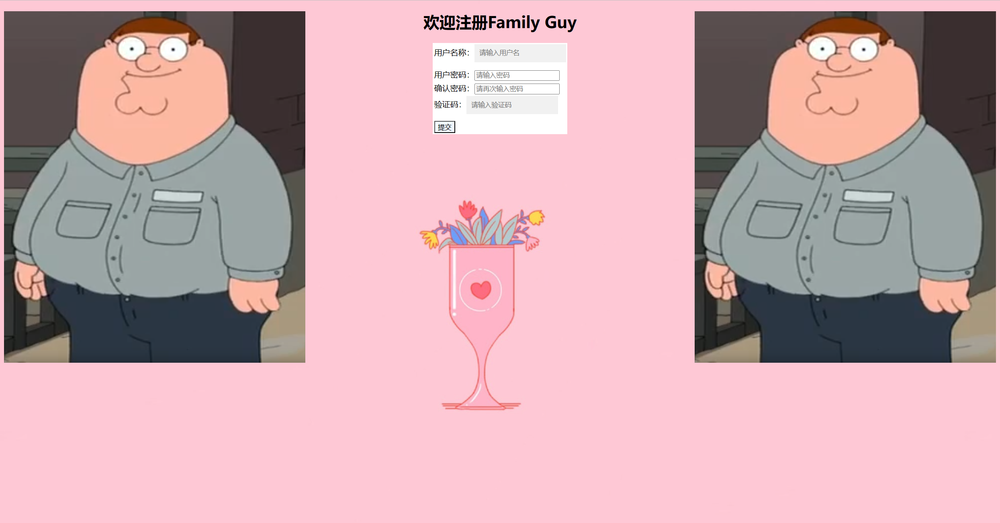

然后我就把代码丢给GPT让他帮我搞工整一点

代码是这样的

```html
<!DOCTYPE html>
<html lang="en">
<head>
  <meta charset="UTF-8">
  <title>Title</title>
  <style>
    body {
      background-image: url("../imag/R-C.jpg");
      font-family: Arial, sans-serif;
    }
    .container {
      width: 500px;
      background-color: #fff;
      margin: 0 auto;
      padding: 20px;
      border-radius: 5px;
      box-shadow: 0 0 10px rgba(0, 0, 0, 0.1);
    }
    h1 {
      text-align: center;
      margin-bottom: 30px;
    }
    label {
      display: block;
      margin-bottom: 5px;
    }
    input[type=text], input[type=password] {
      display: block;
      width: 100%;
      border: none;
      background-color: #f1f1f1;
      padding: 10px;
      margin-bottom: 20px;
    }
    button {
      display: block;
      width: 100%;
      background-color: aliceblue;
      border: none;
      padding: 10px;
      cursor: pointer;
      transition: background-color 0.3s;
      border-radius: 5px;
    }
    button:hover {
      background-color: #cfe2ff;
    }
    span {
      display: block;
      text-align: center;
      margin-bottom: 10px;
      color: red;
    }
  </style>
  <script type="text/javascript" src="jquery-3.6.4.js"></script>
  <script type="text/javascript">
    $(document).ready(function(){
      //验证用户名，密码是否符合规则
      $("#btn1").click(function(){
        var e1=$("#username").val();
        var name_rul=/^\w{5,12}$/;
        if(!name_rul.test(e1)){
          $("#errormsg").text("用户名不合法");
          return false;
        }
        else{
          $("#errormsg").text("");
        }
        var e2=$("#password").val();
        var psd_rul=/^\w{5,12}$/;
        if(!psd_rul.test(e2)){
          $("#errormsg").text("密码不合法");
          return false;
        }
        else{
          $("#errormsg").text("");
        }
        var e3=$("#repassword").val();
        if(e3!=e2){
          $("#errormsg").text("两次输入的密码不一致");
          return false;
        }
        else{
          $("#errormsg").text("");
        }
        var e4=$("#check").val();
        if(e4==null||e4==""){
          $("#errormsg").text("验证码不能为空");
          return false;
        }
        else{
          $("#errormsg").text("");
        }
      });
    });
  </script>
</head>
<body>


<div class="container">
  <h1>欢迎注册Family Guy</h1>
  <span id="errormsg"></span>
  <label for="username">用户名称：</label>
  <input type="text" placeholder="请输入用户名" autocomplete="off" tabindex="1" id="username">
  <label for="password">用户密码：</label>
  <input type="password" placeholder="请输入密码" autocomplete="off" tabindex="1" id="password">
  <label for="repassword">确认密码：</label>
  <input type="password" placeholder="请再次输入密码" autocomplete="off" tabindex="1" id="repassword">
  <label for="check">验证码：</label>
  <input type="text" placeholder="请输入验证码" autocomplete="off" tabindex="1" id="check">
  <button id="btn1" type="button">提交</button>
</div>
</body>
</html>
```

运行结果是这样的(看上去好看多了...)

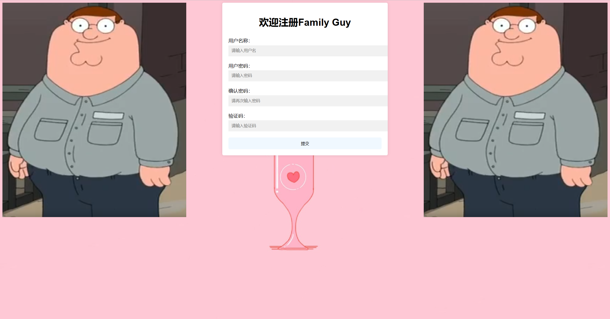

## 5.XML

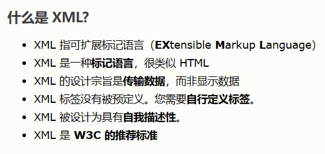

### 5.1xml的主要作用有：

1. 用来保存数据，而且这些数据具有自我描述性
2. 它还可以作为项目或模块的配置文件
3. 还可以作为网络传输数据的格式（JSON为主)

xml文件示例

```xml
<?xml version="1.0" encoding="UTF-8" ?>
<books>
    <book sn="SN123456789">
        <name>白夜行</name>
        <author>东野圭吾</author>
        <price>30</price>
    </book>

    <book>
        <name>魔球</name>
        <author>东野圭吾</author>
        <price>20</price>

    </book>
</books>
```

### 5.2xml语法规则

- 所有xml元素必须有关闭标签
- xml标签对大小写敏感
- xml必须正确的嵌套
- xml文档必须有根元素
- xml的属性值加引号(和html类似)
- xml空格会被保留(不像html)

### 5.3xml命名规则

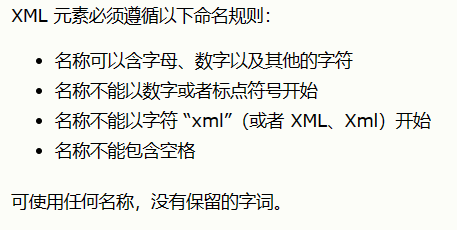

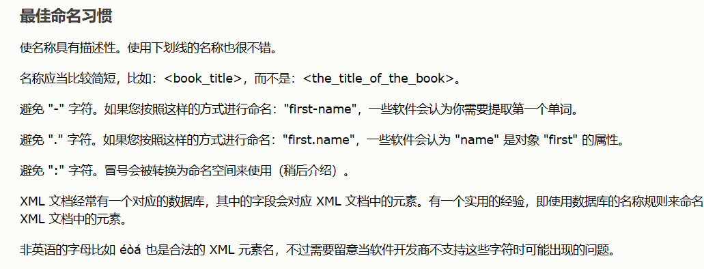

### 5.4dom4j解析xml文件

要想使用dom4j，要先导入jar包，推荐个很牛逼的网站：https://mvnrepository.com，进去之后直接搜dom4j再下载jar包就行了

要先创建好xml文件对应的类

book类

```java
package XML;

public class book {
    private String name;
    private String author;
    private String sn;
    public String getName() {
        return name;
    }

    public void setName(String name) {
        this.name = name;
    }

    public book(String name, String author, double price,String sn) {
        this.name = name;
        this.author = author;
        this.price = price;
        this.sn=sn;
    }

    @Override
    public String toString() {
        return "book{" +
                "name='" + name + '\'' +
                ", author='" + author + '\'' +
                ", sn='" + sn + '\'' +
                ", price=" + price +
                '}';
    }

    public String getAuthor() {
        return author;
    }

    public void setAuthor(String author) {
        this.author = author;
    }

    public double getPrice() {
        return price;
    }

    public void setPrice(double price) {
        this.price = price;
    }

    private double price;

}
```

xml文件如上

测试类

```java
package XML;

import com.sun.org.apache.xerces.internal.dom.ElementNSImpl;
import org.dom4j.Document;
import org.dom4j.DocumentException;
import org.dom4j.Element;
import org.dom4j.io.SAXReader;
import org.junit.Test;

import java.util.List;

public class Dom4jTest {
    @Test
    public void test1(){
        SAXReader saxReader=new SAXReader();
        try {
            Document document=saxReader.read("src/XML/books.xml");
            System.out.println(document);
        } catch (DocumentException e) {
            throw new RuntimeException(e);
        }
    }

    @Test
    public void test2() throws Exception{
        SAXReader saxReader=new SAXReader();
        Document document= saxReader.read("src/XML/books.xml");
        Element rootElement=document.getRootElement();
        System.out.println(rootElement);
        List<Element> book = rootElement.elements("book");
        for(Element b:book){
            //直接获取内容
            String nameText=b.elementText("name");
            String priceText=b.elementText("price");
            String authorText=b.elementText("author");
            System.out.println(nameText+priceText+authorText);
            //获取属性值
            String snValue=b.attributeValue("sn");
            System.out.println(new book(nameText,authorText,Double.parseDouble(priceText),snValue));
        }
    }
}

```

## 6.Tomcat

直接去官网下载tomcat：https://tomcat.apache.org/

然后涉及到环境变量的配置这个自己去网上找教程就可以了，但是要注意jdk版本不能太高，要不然一直无法运行tomcat(我就是这样的)

再然后就是在IDEA上面部署web模板，照着网上弄就行了，我的tomcat下载的是7.xx的版本然后在运行原始的jsp文件时候会报错，报错如下

```
严重: Unable to process Jar entry [META-INF/versions/9/module-info.class] from Jar [jar:file:/D:/workspace/tomcat/out/artifacts/tomcat_war_exploded/WEB-INF/lib/gson-2.10.1.jar!/] for annotations org.apache.tomcat.util.bcel.classfile.ClassFormatException: In
```

这是因为自己的tomcat版本过低但是导入的jar包版本过高，解放方法有两种，第一种是下载更高版本的tomcat，第二种是下载更低版本的jar包直到不报错就行

还有一个报错是显示端口被占用，改个端口就行了

## 7.Servlet

### 7.1什么是Servlet

- Servlet是java的规范之一，规范就是接口
- Servlet是java3大组件之一。Servlet程序，Filter过滤器和Listener监听器
- Servlet是运行在服务器上的一个java小程序，能够接收客户端发来的请求并响应数据给客户端

### 7.2第一个Servlet程序

xml文件

```xml
<?xml version="1.0" encoding="UTF-8"?>
<web-app xmlns="http://xmlns.jcp.org/xml/ns/javaee"
         xmlns:xsi="http://www.w3.org/2001/XMLSchema-instance"
         xsi:schemaLocation="http://xmlns.jcp.org/xml/ns/javaee http://xmlns.jcp.org/xml/ns/javaee/web-app_4_0.xsd"
         version="2.5">
<!--servlet标签给Tomcat配置Servlet程序-->

    <servlet>
        <!--servlet-name标签给Servlet程序起一个别名(一般是类名)-->
        <servlet-name>HelloServlet</servlet-name>
        <!--servlet-class标签是Servlet程序的全类名-->
        <servlet-class>com.fzj.Servlet.HelloServlet</servlet-class>
    </servlet>


    <!--给servlet程序配置访问地址-->
    <servlet-mapping>
        <!--告诉服务器我当前配置的地址给哪个servlet程序使用-->
        <servlet-name>HelloServlet</servlet-name>
        <!--配置访问地址
             /在服务器解析的时候表示地址为http://ip:port/工程路径
             /hello表示地址为http://ip:port/工程路径/hello
        -->
        <url-pattern>/hello</url-pattern>
    </servlet-mapping>
</web-app>
```

java类

```java
package com.fzj.Servlet;

import javax.servlet.*;
import java.io.IOException;

public class HelloServlet implements Servlet {


    @Override
    public void init(ServletConfig servletConfig) throws ServletException {

    }

    @Override
    public ServletConfig getServletConfig() {
        return null;
    }

    @Override
    public void service(ServletRequest servletRequest, ServletResponse servletResponse) throws ServletException, IOException {
        System.out.println("Hello Servlet");
    }

    @Override
    public String getServletInfo() {
        return null;
    }

    @Override
    public void destroy() {

    }
}

```

### 7.3Servlet生命周期

1. 执行Servlet构造器方法

2. 执行init初始化方法

   第一、二步，是在第一次访问的时候创建Servlet程序会调用，说明这个程序是单例的。

3. 执行service方法

   第三步：每次访问都会调用

4. 执行destory销毁方法

   第四步：在web工程停止的时候调用

### 7.4请求的分发处理

```html
<!DOCTYPE html>
<html lang="en">
<head>
  <meta charset="UTF-8">
  <title>Title</title>
</head>
<body>
<form action="http://localhost:7777/tomcat/hello" method="get">
  <input type="submit">
</form>
</body>
</html>
```

```java
package com.fzj.Servlet;

import javax.servlet.*;
import javax.servlet.http.HttpServletRequest;
import java.io.IOException;

public class HelloServlet implements Servlet {


    @Override
    public void init(ServletConfig servletConfig) throws ServletException {

    }

    @Override
    public ServletConfig getServletConfig() {
        return null;
    }

    @Override
    public void service(ServletRequest servletRequest, ServletResponse servletResponse) throws ServletException, IOException {
        System.out.println("Servlet启动");
        HttpServletRequest httpServletRequest= (HttpServletRequest) servletRequest;
        if("GET".equals(httpServletRequest.getMethod())){
            System.out.println("GET方法");
        }
        else if("POST".equals(httpServletRequest.getMethod())){
            System.out.println("POST方法");
        }
    }

    @Override
    public String getServletInfo() {
        return null;
    }

    @Override
    public void destroy() {

    }
}
```

### 7.5通过继承HttpServlet类实现Servlet程序

servlet.xml文件也要配置一下，依葫芦画瓢就行了

```java
package com.fzj.Servlet;

import javax.servlet.ServletException;
import javax.servlet.http.HttpServlet;
import javax.servlet.http.HttpServletRequest;
import javax.servlet.http.HttpServletResponse;
import java.io.IOException;

public class HelloServlet1 extends HttpServlet {
    @Override
    //在get请求的时候调用
    protected void doGet(HttpServletRequest req, HttpServletResponse resp) throws ServletException, IOException {
        System.out.println("doGet方法");
    }
    //在post请求的时候调用
    @Override
    protected void doPost(HttpServletRequest req, HttpServletResponse resp) throws ServletException, IOException {
        System.out.println("doPost方法");
    }
}
```

### 7.6IDEA菜单生成Servlet程序

package下new一个Servlet再输入类名就行了

### 7.7.整个Servlet的继承体系

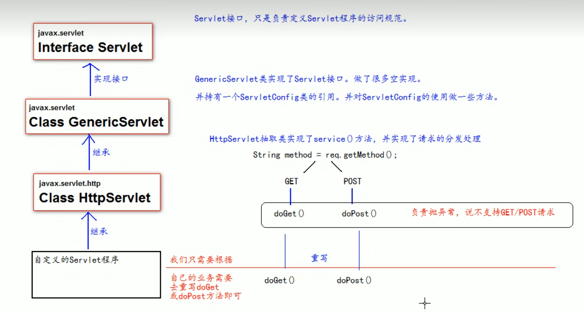

### 7.8ServletConfig

 xml文件

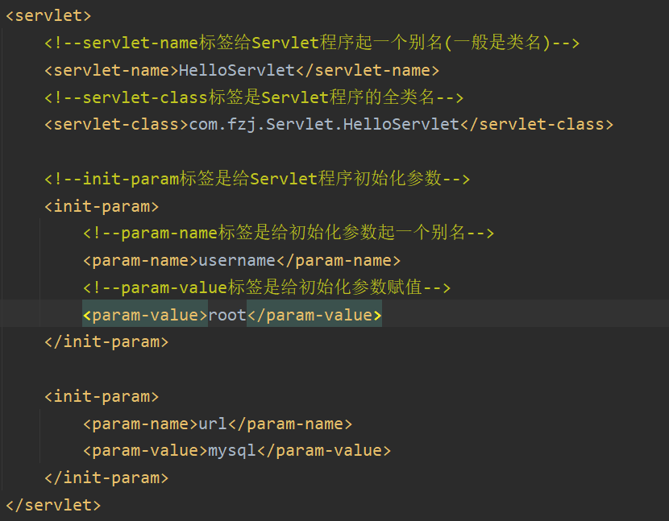

Servlet程序

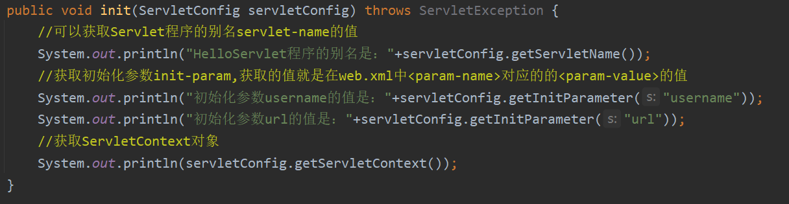

如果要在自己的Servlet程序中重写init类，要保留父类中的init方法不然会报空指针异常，除非子类中重写的方法也初始化了ServletConfig对象，但是我没有保留父类的方法也没有初始化ServletConfig对象也没有报错不知道为啥...

### 7.9ServletContext

web.xml中的配置

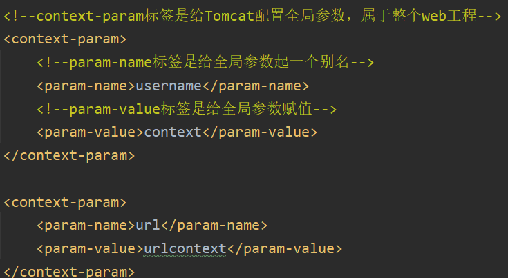

```java
package com.fzj.Servlet;

import javax.servlet.*;
import javax.servlet.http.*;
import java.io.IOException;

public class ContextServletTest extends HttpServlet {
    @Override
    protected void doGet(HttpServletRequest request, HttpServletResponse response) throws ServletException, IOException {
        //获取ServletContext对象
        ServletContext servletContext = getServletContext();
        //设置数据
        servletContext.setAttribute("key1","value1");
        //获取数据
        System.out.println("context-param参数key1的值是："+servletContext.getAttribute("key1"));
        //获取web.xml中配置的上下文参数context-param
        String username = servletContext.getInitParameter("username");
        String url = servletContext.getInitParameter("url");
        System.out.println("context-param参数username的值是："+username);
        System.out.println("context-param参数url的值是："+url);
        //获取当前的工程路径，格式：/工程路径
        System.out.println("当前工程路径："+servletContext.getContextPath());
        //获取工程部署后在服务器硬盘上的绝对路径
        //斜杠被服务器解析地址为：http://ip:port/工程路径/  映射到IDEA代码的web目录
        System.out.println("工程部署的路径是："+servletContext.getRealPath("/"));
        System.out.println("工程下css目录的绝对路径是："+servletContext.getRealPath("/css"));
        System.out.println("工程下imgs目录的绝对路径是："+servletContext.getRealPath("/imgs"));

    }
}

```

ServletContext存储对象，因为一个工程只有一个ServletContext对象，所以他们的属性和值是可以共用的，我现在创建一个ServletContext对象为S1，S1中设置key1为value1，我现在再创建一个ServletContext对象为S2，通过S2可以存储S1的key1和value1

### 7.10HTTP

HTTP协议指的是客户端和服务端通信时，发送的数据需要遵守的协议，HTTP协议中的数据叫做报文

#### 7.10.1GET请求协议内容

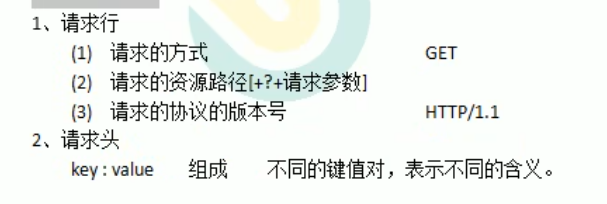

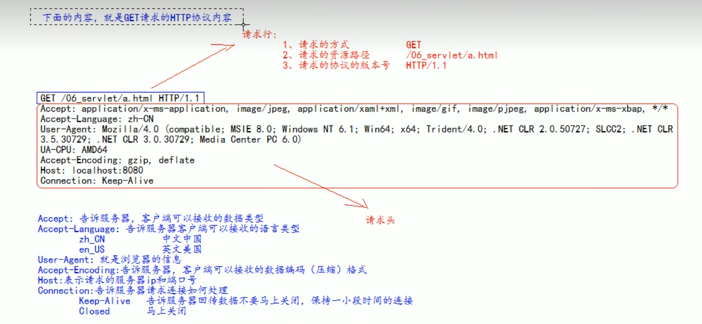

#### 7.10.2POST请求协议内容

请求行和请求头和上述GET方式一样，多了个请求体来加载自己提交上去的数据

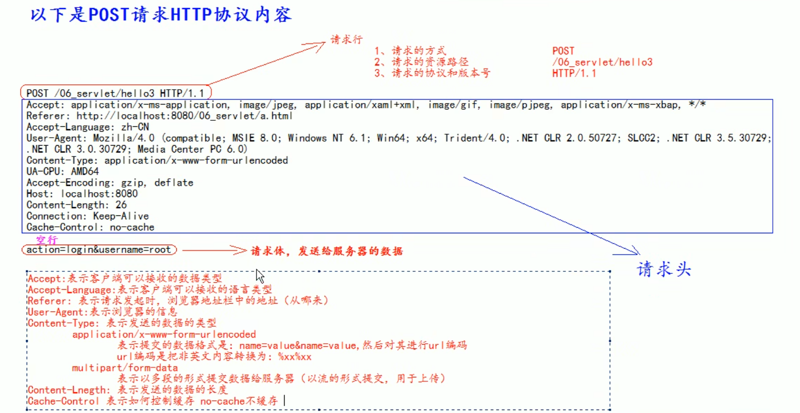

#### 7.10.3GET请求和POST请求的区分

GET请求：

- form标签中method=get
- a标签
- link标签中引入css
- Script标签中引入js文件
- img标签中引入图片
- iframe引入html页面
- 在浏览器地址栏输入地址后敲回车

POST请求：

- ​	form标签中method=post

#### 7.10.4常见的响应码说明

- 200 	 表示请求成功
- 302     表示请求重定向
- 404	 表示请求服务器已经收到了，但是你要的数据不存在(请求地址错误)
- 500 	表示服务器已经收到请求，但是服务器内部错误(代码错误)

#### 7.10.5MIME类型说明

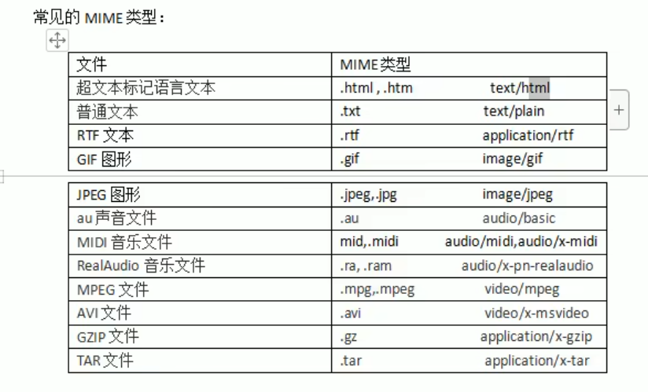
